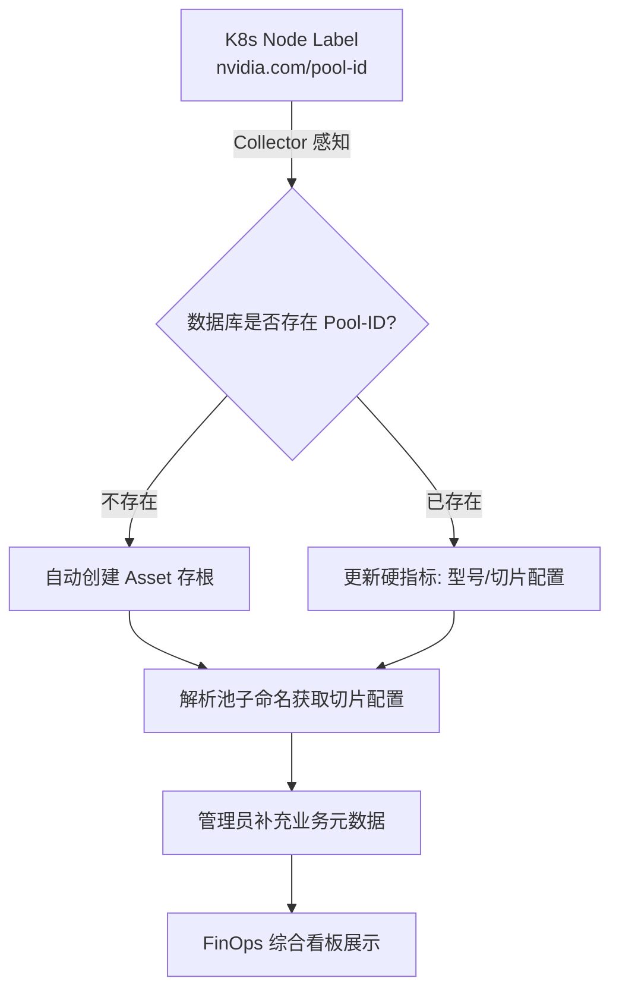

# AIPower-Efficiency-Pilot 资源池资产管理实现逻辑

## 1. 核心理念：从”标签”到”资产” (Label to Asset)
在 K8s 底层，资源池仅仅是 Node 上的一个 Label（如 `nvidia.com/pool-id`）。在 FinOps 体系中，我们需要将这个”字符串”转化为一个具有业务属性的”资产实体”，从而支持成本分摊、效能分析与场景对标。

## 2. 池子命名规范

采用约定优于配置的设计，池子 ID 编码了关键信息：

```
pool-{mode}-{vendor}-{spec}

# 示例
pool-full-A100           → Full 模式，A100，权重 1.0
pool-full-H800           → Full 模式，H800，权重 1.0
pool-mig-A100-2g         → MIG 2g 规格，A100，权重由申请量决定
pool-mps-A100-50         → MPS 50%，权重 0.5
pool-ts-T4-30            → TS 30%，权重 0.3
```

## 3. 资产发现流转图 (Data Flow)



## 4. 实现细节

### 4.1 自动注册逻辑 (Auto-Registration)
当 `K8sCollector` 监听到 Node 的 Add/Update 事件时：
1.  提取标签 `nvidia.com/pool-id`。
2.  提取硬件信息 `nvidia.com/gpu.product` 和厂商。
3.  调用 `parsePoolSlicingConfig()` 从池子名称解析切片模式和最大单元数：
    - `pool-full-*` → Full 模式，max_units=1
    - `pool-mig-*` → MIG 模式，max_units=7 (A100) 或查表
    - `pool-mps-*` → MPS 模式，max_units=100
    - `pool-ts-*` → TS 模式，max_units=100
4.  调用 `UpsertResourcePool` 方法：
    *   **Insert**: 若为新池子，写入完整配置
    *   **Update**: 若已存在，仅同步最新的硬件型号与切分配置，保留管理员手动修改的业务元数据

### 4.2 业务元数据模型 (Metadata Schema)
| 字段 | 来源 | 说明 |
| :--- | :--- | :--- |
| **Pool ID** | K8s Label | 唯一标识（主键），如 `pool-mig-A100-2g` |
| **业务别名** | 手动录入 | 友好名称，如”搜索中心核心推理池” |
| **业务场景** | 手动录入 | 场景：大模型预训练、模型微调、核心推理、小模型推理、研发调试 |
| **GPU 型号** | 自动感知 | 真实型号，如 `NVIDIA A100-SXM4-80GB` |
| **GPU 厂商** | 自动感知 | 厂商：nvidia, intel, amd |
| **硬件特性** | 自动感知 | 关键能力：NVLink, RDMA, TF32, FP8, Multi-Instance GPU 等 |
| **切分模式** | 自动感知 | 虚拟化技术：Full, MIG, MPS, TS |
| **最大切片单元数** | 自动感知+手动覆盖 | 单卡最大切片数（如 A100 MIG=7），可被管理员手动覆盖 |
| **定价逻辑** | 手动录入 | 财务属性：资源预留 (Reserved), 按规格计费, 吞吐量分摊, 极低单价 (Spot) |
| **治理优先级** | 手动录入 | 治理权重：生产级 (High), 测试级 (Low) |
| **资产描述** | 手动录入 | 补充说明，如”2024年三期采购，主要用于 LLM 提效” |

### 4.3 GPU 最大切片实例数映射表

| GPU 型号 | 最大 MIG 实例数 | 说明 |
| :--- | :--- | :--- |
| NVIDIA A100-SXM4-80GB | 7 | 官方支持 7 个 MIG-1g.5gb |
| NVIDIA A100-SXM4-40GB | 7 | 同上 |
| NVIDIA H100-SXM5-80GB | 7 | H100 7 实例 MIG |
| 其他型号 | 1 | 默认值，未知型号视为整卡 |

管理员可通过修改数据库 `resource_pool.max_slicing_units` 字段覆盖默认值。

### 4.4 与计费引擎的关联
*   **定价索引**：计费引擎通过 `pool_id` 在 `pool_pricing` 表中查找单价。
*   **动态权重**：`life_trace.slicing_weight = slicing_units / resource_pool.max_slicing_units`
*   **效能量化**：资源池资产管理提供的”业务场景”标签，可用于在看板上进行”同类场景利用率对标”。

## 5. 管理操作
*   **资产盘点**：提供全局视图，查看当前 K8s 集群中实际存在的物理池。
*   **信息补全**：管理员通过 UI 界面，将技术侧的 Pool-ID 与财务侧的成本中心完成映射。
*   **切片配置覆盖**：对于特殊切分策略的节点，管理员可手动设置 `max_slicing_units`。
